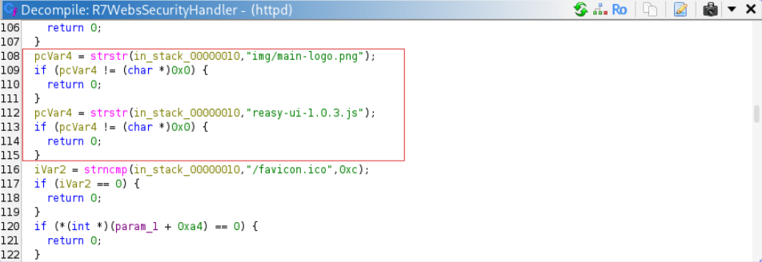
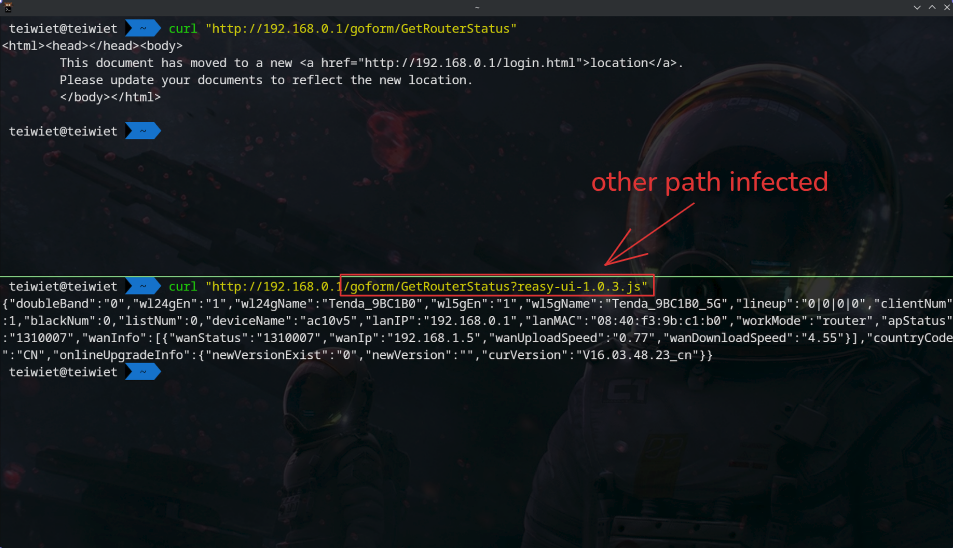
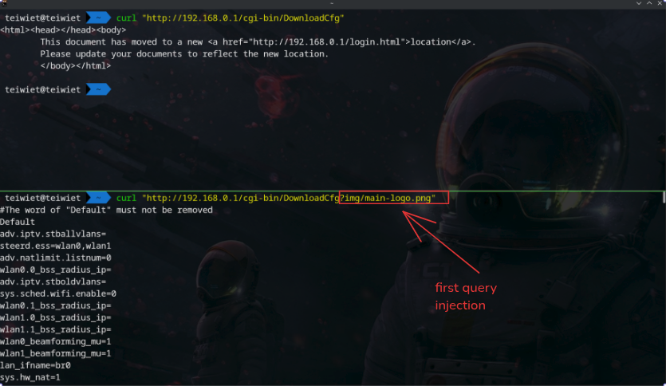
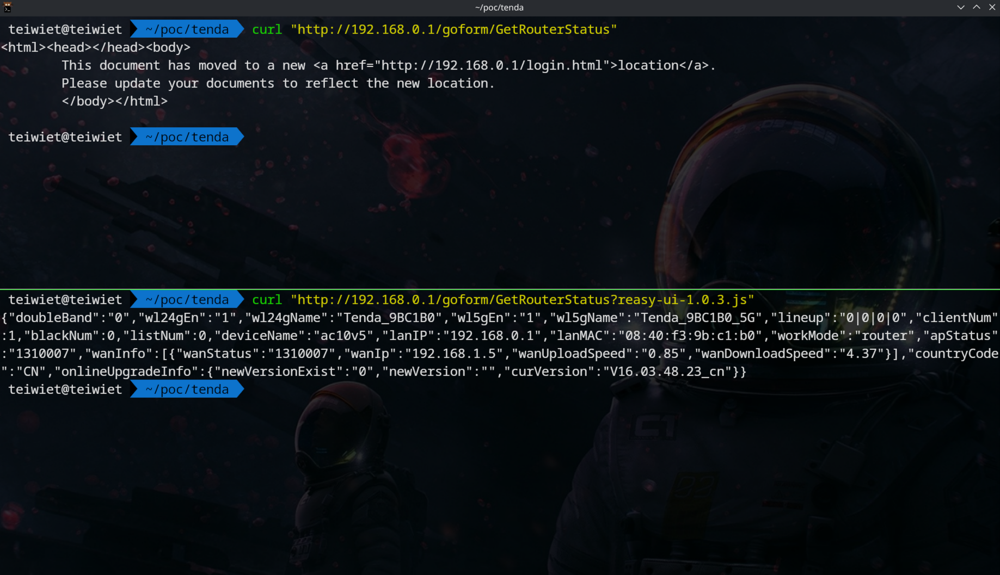

# [TENDA] [AC10 V4.0] [US_AC10V4.0si_V16.03.10.09_multi_TDE01] — `R7WebsSecurityHandler` Authentication Bypass via Query String Injection

## Summary

An authentication bypass exists in the web management interface of Tenda AC10 V4.0. The security handler `R7WebsSecurityHandler` applies whitelist checks against the raw, unstripped request URL — including the query string — using `strstr`, while all other authentication logic operates on the URL with the query string removed. An unauthenticated remote attacker can inject a whitelisted string as a query parameter to bypass authentication and access any protected endpoint, including configuration download, log download, raw flash dump, and all administrative setter handlers.

## Vulnerability Type

- **CWE-287:** Improper Authentication
- **CWE-697:** Incorrected Comparison

## Affected Component

| Field | Value |
|---|---|
| Vendor | Tenda |
| Product | Tested on AC10 V4.0/AC10 V5.0 |
| Firmware version | `US_AC10V4.0si_V16.03.10.09_multi_TDE01.bin` |
| Binary | `httpd` |
| Handler | `R7WebsSecurityHandler` |
| Registered scope | All paths (WEBS_HANDLER_FIRST) |

## Technical Description

`R7WebsSecurityHandler` is registered as the first-priority URL handler for all requests. It strips the query string from the URL into a local buffer for most checks, but two whitelist entries use `strstr` directly against the raw URL `in_stack_00000010`, which includes the query string:

Because `strstr` searches the entire raw URL including the query string, appending `?reasy-ui-1.0.3.js` or `?img/main-logo.png` to any request URL satisfies the check and causes the handler to return 0 (pass) without performing any credential verification.

The downstream dispatch in `webCgiDoUpload` and `websFormHandler` receives only the path component and routes normally, so the bypass is transparent to all subsequent handlers.

## Attack Prerequisites

- Network access to the web management interface (LAN or WAN if remote management enabled)
- No credentials required

## Impact

Unauthenticated access to all protected endpoints:

| Endpoint | Impact |
|---|---|
| `/cgi-bin/DownloadCfg` | Download device configuration |
| `/cgi-bin/DownloadLog` | Download system logs |
| `/cgi-bin/upgrade` | Reachable |
| `/goform/*` | All administrative setters (LAN, WiFi, DHCP, DNS, VPN) |

## Proof of Concept

No authentication required.

Expected response without bypass: HTTP 302 redirect to `login.html`.  
Observed response with bypass: HTTP 200 with handler output.

## Disclosure Timeline

| Date | Event |
|---|---|
| 2026-06-26 | Vulnerability discovered |
| 2026-06-26 | Advisory drafted |
| 2026-06-26 | Vendor notified(productsecure@tenda.cn) |
